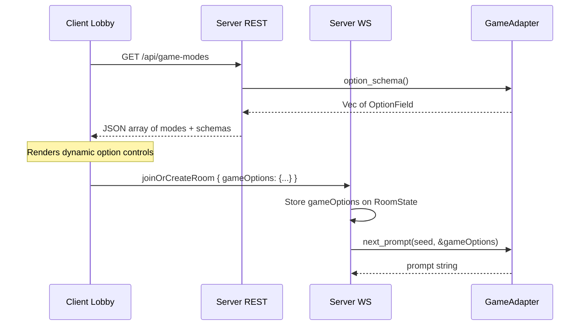

# Adapter Game Options

## Architecture




## 1. Rust Core: Option Schema Types

Add to `[core/src/adapter.rs](core/src/adapter.rs)`:

```rust
#[derive(Debug, Clone, Serialize)]
#[serde(rename_all = "camelCase")]
pub struct OptionField {
    pub key: String,
    pub label: String,
    #[serde(flatten)]
    pub kind: OptionFieldKind,
}

#[derive(Debug, Clone, Serialize)]
#[serde(tag = "type", rename_all = "camelCase")]
pub enum OptionFieldKind {
    Select {
        choices: Vec<SelectChoice>,
        default: String,
    },
}

#[derive(Debug, Clone, Serialize)]
#[serde(rename_all = "camelCase")]
pub struct SelectChoice {
    pub value: String,
    pub label: String,
}
```

Only `Select` is needed now; future adapters can add `Toggle`, `Range`, etc. to `OptionFieldKind`.

## 2. Rust Core: Extend `GameAdapter` Trait

In `[core/src/adapter.rs](core/src/adapter.rs)`, update the trait:

```rust
pub trait GameAdapter: Send + Sync + 'static {
    fn game_key(&self) -> &'static str;
    fn game_label(&self) -> &'static str { self.game_key() }
    fn option_schema(&self) -> Vec<OptionField> { vec![] }
    fn next_prompt(&self, seed: u64, options: &serde_json::Value) -> String;
    fn is_correct(&self, prompt: &str, attempt: &str) -> bool;
    fn normalize_progress(&self, raw_input: &str) -> String;
    fn score_for_prompt(&self, prompt: &str) -> f32;
    fn input_placeholder(&self) -> &'static str { ... }
}
```

Key change: `next_prompt` now takes `options: &serde_json::Value`. Adapters that don't use options simply ignore the parameter.

## 3. Rust Core: Protocol Changes

In `[core/src/protocol.rs](core/src/protocol.rs)`, add `game_options` to `JoinOrCreateRoom`:

```rust
JoinOrCreateRoom {
    player_name: Option<String>,
    room_code: Option<String>,
    game_mode: Option<String>,
    match_duration_secs: Option<u64>,
    game_options: Option<serde_json::Value>,  // NEW
}
```

## 4. Rust Core: RoomState Changes

In `[core/src/game.rs](core/src/game.rs)`, add `game_options` field to `RoomState`:

```rust
pub struct RoomState {
    // ...existing fields...
    pub game_options: serde_json::Value,
}
```

Default to `serde_json::Value::Null`. Stored at room creation, passed to `next_prompt()` in `[core/src/server.rs](core/src/server.rs)` `ensure_prompt_for_room`.

## 5. Rust Core: New REST Endpoint

In `[core/src/server.rs](core/src/server.rs)`, add `GET /api/game-modes`:

```rust
#[derive(Serialize)]
#[serde(rename_all = "camelCase")]
struct GameModeInfo {
    key: String,
    label: String,
    options: Vec<OptionField>,
}

async fn game_modes_handler(State(state): State<Arc<SharedState>>) -> impl IntoResponse {
    let modes: Vec<GameModeInfo> = state.adapters.values()
        .map(|a| GameModeInfo {
            key: a.game_key().to_string(),
            label: a.game_label().to_string(),
            options: a.option_schema(),
        })
        .collect();
    axum::Json(modes)
}
```

Register as `.route("/api/game-modes", get(game_modes_handler))`.

Note: `AdapterRegistry` is a `HashMap` which has non-deterministic iteration order. We should either sort by key or use a `Vec`-backed ordered structure to ensure the order returned by the endpoint matches the adapter registration order. The simplest fix: keep an `adapter_order: Vec<String>` on `SharedState` populated from the registration vec, and iterate in that order.

## 6. Rust: Update Keyboarding Adapter

In `[adapters/keyboarding/src/lib.rs](adapters/keyboarding/src/lib.rs)`:

- Update `next_prompt` signature to accept `options` parameter (ignored).
- Add `game_label()` returning `"Keyboarding"`.

## 7. Rust: Update Arithmetic Adapter

In `[adapters/arithmetic/src/lib.rs](adapters/arithmetic/src/lib.rs)`:

- Add `game_label()` returning `"Arithmetic"`.
- Implement `option_schema()` returning two select fields:
  - `operation`: Addition (default), Subtraction
  - `digits`: 1 Digit (default), 2 Digits, 3 Digits
- Update `next_prompt(seed, options)` to parse options and generate appropriate expressions:
  - For subtraction: ensure left >= right (no negative results).
  - For N digits: constrain operands to `10^(N-1)..10^N - 1` range (or `1..9` for 1 digit).
- Update `is_correct` and `eval_sum_prompt` to handle both `+` and `-` operators.
- Add tests for subtraction and multi-digit prompts.

## 8. Client: TypeScript Protocol Updates

In `[client/src/lib/game/protocol.ts](client/src/lib/game/protocol.ts)`:

- Add `gameOptions?: Record<string, string>` to the `joinOrCreateRoom` client message type.

In `[client/src/lib/game/connection.svelte.ts](client/src/lib/game/connection.svelte.ts)`:

- Add `gameOptions` to the `connect()` opts and pass through to `sendClientMessage`.

## 9. Client: Fetch Game Modes and Render Dynamic Options

In `[client/src/routes/+page.svelte](client/src/routes/+page.svelte)`:

- On mount, `fetch('/api/game-modes')` to get available modes and their option schemas.
- Replace the hardcoded game mode `Select` with data from the endpoint.
- When a mode with options is selected, render additional `Select` controls dynamically from the schema.
- Collect selected option values into a `Record<string, string>` and pass as `gameOptions` in `connect()`.
- Remove the hardcoded `GameMode` type from `connection.svelte.ts` (game modes are now server-driven).

## 10. Rust Core: Dependency Addition

Add `serde_json` as a dependency to `core/Cargo.toml` (it's likely already present via serde, but needs to be explicit for `serde_json::Value`).

## Files Changed Summary

- `**core/Cargo.toml**` -- add `serde_json` dep if not present
- `**core/src/adapter.rs**` -- option schema types + trait extension
- `**core/src/protocol.rs**` -- `gameOptions` field on `JoinOrCreateRoom`
- `**core/src/game.rs**` -- `game_options` on `RoomState`
- `**core/src/server.rs**` -- store/pass options, new REST endpoint, adapter ordering
- `**adapters/keyboarding/src/lib.rs**` -- updated signature, `game_label()`
- `**adapters/arithmetic/src/lib.rs**` -- options schema, multi-op/digit prompt generation
- `**client/src/lib/game/protocol.ts**` -- `gameOptions` type
- `**client/src/lib/game/connection.svelte.ts**` -- pass `gameOptions`, remove hardcoded `GameMode`
- `**client/src/routes/+page.svelte**` -- fetch modes, dynamic option rendering

